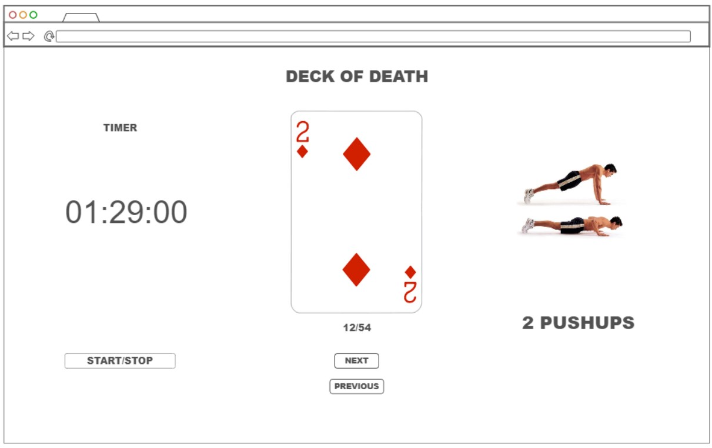

# Deck of Death

## Elevator Pitch

Sometimes it is really hard to get to the gym. You may have a busy schedule or you may have responsibilities at home that keep you away. Whatever the reason mya be, you should still be able to get the exercise you need and want. The Deck of Death application uses a virtual deck of cards where you assign four workouts that typically can be done in your home to each suit. The app will randomly shuffle the cards and you complete the specified number of repetitions on the card. You can keep track of your workouts, the time it takes to complete them, and you can even workout with friends! 

## Key Features
- Secure login over HTTPS
- Ability to select workouts for each suit.
- Displays the current card, how many are left, and the time elapsed during your workout.
- Ability to connect with friends and receive notifications when they have started/completed a workout. 
- Workouts are persistently stored. 

## Design
This is a rough design of what the UI will look like during the workout.

The backend will randomly go through all the cards in the deck and send notifications to your friends when you are starting/completing a workout if they have connected to the server. 

## Technologies

- **HTML** - Uses correct HTML structure for application. Three HTML pages. One for login, one choosing a workout, and one during the workout.
- **CSS** - Application styling that looks good on different screen sizes, uses good whitespace, color choice and contrast.
- **JS** - Automate the buttons and performs the actions prompted in CSS/HTML. Will have a virtual deck of cards that it will run through. 
- **React** - Routing the components of the program, provides login, workouts you can do, and friends list.
- **Service** - Backend service with endpoints for:
  - login
  - retrieving workout history
  - submitting workout data
  - retrieving workout data from friends
  - uses a service to generate pictures of cards.
- **DB/Login** - Store users, friends, and data from each workout.
- **WebSocket** - You will receive a notification when a friend is participating, completes a workout/online. 

## Startup HTML Deliverable
- **HTML Pages**
  - index.html is the page to login where you can sign in or sign up. You can access this page by navigating to startup.deckofdeath.click or clicking on "Home" on the navigation menu in the application. 
  - newWorkout.html is the page to configure your workout and begin. You can access this page by clicking on the "Begin New Workout" button on the navigation menu.
  - workoutbegins.html is the page that shows up as you are completing the workout. It displays the current workout with the corresponding card and a stop watch to track your time. You can access this page by going to New Workout and pressing the begin button.
  - history.html is the page where you can track your workout history with the time it took to complete it and the date you completed it. You can access this page by clicking on "Workout History" in the navigation menu.
  - friends.html is the page where you can connect with friends and see the progress your friends have made. You can access this page by clicking on "Friends" in the navigation menu.
  - about.html is the page that gives information about what the deck of death is and the goal and capabilities of the deck of death web application. You can access this page by clicking "About" in the navigation menu. 
- **Simon HTML** is deployed to simon.deckofdeath.click
- **Application Images** were generated using Imagen 3 AI software.
- **Database** will be implemented to keep track of signed up users and friends of each users along with their workout data. 
- **WebSocket** will be implemented to let friends know when they are working out. This is shown with a notification ribbon at the bottom of each page. 

## Startup CSS Deliverable
- **Bootstrap**
  - I implemented the Bootstrap framework into the html pages and styled each page with the same footers and headers. 
  - I used a color scheme that seemed most intuitive for the Deck of Death. I used mostly light/dark greys and white. 
  - I formatted the spacing of the text and images using bootstrap commands and also separate css files for each page to allow for any specific updates in the future. 
- **Project Changes**
  - I think I will use an API for the timer instead of generating pictures. I think it will be a bit cheaper that way and still fulfills the requirement of an outside service. 

## Startup React Deliverable
- **React Port using Vite**
  - I successfully ported my application to React and bundled it using Vite.
- **React Components**
  - Login page now allows you to create an account and login using React components.
  - Name appears at the top when you are logged in. 
  - You can now create and begin a workout and you can see how many you need to do. This includes the base functionality of going through each card in the deck. Pictures still need to be generated and the stop watch will need to be implemented. 
  - Created a workout class that stores data. This data is then persistently saved in history once the workout begins. 
  - Friends are able to be added. You can see best time and latest workout date placeholders. These are saved persistently.
  - The about page is ported to a jsx file implementing React hooks.
- **React Router**
  - The app.jsx file uses the React Router to navigate to different pages using the navbar tool.
- **React Hooks**
  - Most of the files uses the useEffect hook as well as useNavigate and useState.
- **Changes**
  - Changed "Home" to "Login" on the navbar. 
  
## Startup Service Deliverable
- **Service**
  - HTTP service using Node.js and Express was implemented. 
  - Front end is served up using Express. 
  - My workoutbegins page calls the third party deck of cards service https://deckofcardsapi.com/
  - Backend provides service endpoints for the workouts and users. 
  - Frontend calls those service endpoints. 
- **Changes**
  - I changed "Login" back to "Home" in the navbar. 
  - I decided to switch to a deck of cards for my third party api. It includes a photo of each card as well for ease of use. 

## Startup Login Deliverable
- **MongoDB**
  - MongoDB was implemented to the web application. 
  - Encryption was used for safe password storage.
- **Login**
  - Application now supports new user registration 
  - Supports existing user authentication
  - Stores application data in MongoDB
  - Stores and retrieves credentials in MongoDB
  - Restricts application functionality based on authentication. 

## Startup WebSocket Deliverable
- **WebSocket**
  - The websocket is now implemented 